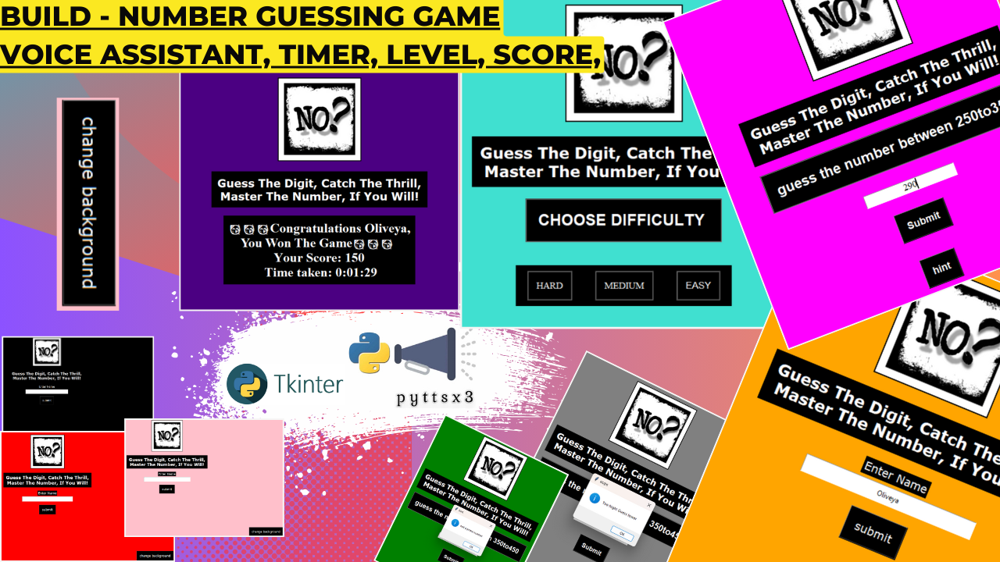

"""
# 🔢 Number Guessing Game in Python 🎮


Welcome to my **Number Guessing Game** built using **Python** and **Tkinter**! 🎮🔢 
This engaging game challenges players to guess a randomly generated number within a specific range. 
It features multiple difficulty levels, hints, score tracking, and an interactive **voice assistant** 
to guide you through the gameplay.

---

### 🖼️ **Game Screenshot**

Here’s a preview of the game:



---

### 📜 **Game Features**

- **Difficulty Levels**: Choose from **Easy**, **Medium**, or **Hard**, each offering different number ranges and allowed attempts.
- **Hints**: Receive clues such as whether the number is even, odd, divisible by 5, or a prime number.
- **Voice Assistant**: An interactive female voice assistant provides verbal feedback on your guesses and hints.
- **Timer**: Track how long it takes to guess the correct number.
- **Score Calculation**: Your score is based on the number of attempts and the time taken to solve the game.
- **Game Over Screen**: Displays your final score and time when you run out of attempts.
- **Customizable Background**: Change the background color randomly.

---

### 🚀 **Installation Instructions**

1. **Clone the repository**:
   ```bash
   git clone https://github.com/Oliveya-15/GUESS-THE-NUMBER.git
2. **Install dependencies: Ensure you have Python installed. Install the required packages**: >> pip install pillow pyttsx3
3. **Run the game: Start the game by running**: >> python gtn code.py

---

🎮 Game Controls
Input Field: Enter your guessed number in the text field.
Submit Button: Click to check your guess.
Hint Button: Click to receive a clue about the number.
Change Background Button: Randomly change the background color.

---

🌟 Contributing
Contributions are welcome! If you'd like to improve this project:

Fork the repository.
Make your changes.
Submit a pull request.
Feel free to open an issue to report bugs or suggest features.

---

📄 License
This project is licensed under the MIT License. See the LICENSE file for details.

---

💬 Feedback
I’d love to hear your thoughts! Share your feedback, report bugs, or suggest features via GitHub issues. You can also reach me at: choudhuryoliveya15@gmail.com


